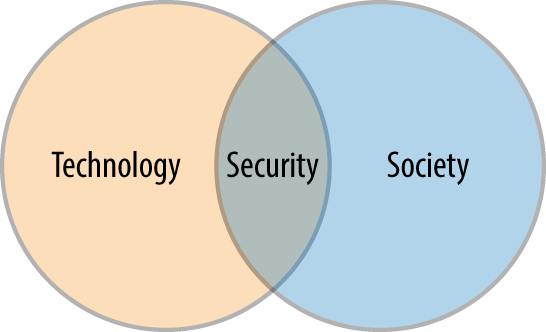

# 第一章： 安全入门

### 什么是安全 （一个看似简单的问题，但是要回答又很复杂。）

如果不去了解安全是什么， 当我们出现在安全问题时， 我们很难理解和处理它。经常在新闻中看到成功黑客攻击了什么， 好像攻击别人的系统特别的简单， 安全感觉就像一个几乎无法理解， 可能无法战胜的领域。

这本书就是从零开始学习敏捷应用安全，介绍一些关键的安全原则， 还将对比传统开发发生的安全性的保障，以及为什么这种方法不再像以前那样有效当敏捷变得越来越普遍。

开发团队的安全性往往侧重于信息安全， 信息安全性在项目开始期间，系统实施期间以及通过系统的运行期间， 我们讨论的安全主要也是讨论的信息安全。

### 安全不仅仅是一个技术问题

作为工程师，我们经常讨论我们系统及其环境的技术选择， 安全迫使我们扩展技术， 安全性可能最好被认为是该技术与常交互的人之间的重叠，如图所示：

这个图它可以简单地看作是一种说明，安全不仅仅是技术，而在其定义中，必须包括人

为什么这说， 人们从一开始就不需要技术来做坏事， 这些活动早在计算机出现之前已经有了。人们已经进化了几千年来撒谎，欺骗和窃取物品以进一步促进自己或组织。然而，当人们开始与技术互动时，这将成为动机，目标和机会的有力组合, 来促使他们进行犯罪。互联网和相关技术使这个世界变得更小，并且这样做使得不对称性更加严峻 - 成本下降，回报增加，被抓获的可能性大幅减少。

随着社会越来越依赖技术，对安全的需求和缺席的影响显着增加。随着技术越来越多地出现在社会结构中，思考其安全性的方法变得越来越重要。传统信息安全方法的一个根本缺点是没有认识到人和技术一样重要。本书中提供新视角的领域来看待安全问题

### 安全不仅仅是极客的问题

有一段时间，安全是政府和极客的需要担心的问题。 但是现在，随着互联网成为全世界人们生活中不可或缺的一部分， 确保其背后的技术与社会的大部分活动相关。如果您使用这些技术，安全就很重要，因为安全性检查失败会直接伤害您和您的组织。

如果您使用技术过构建应用，您的首要目标是保持其稳定和安全的，这样我们就可以在其基础之上改善我们的业务和社会。
 - 您有责任考虑该技术的安全性。
 - 您为人们提供日常生活中的安全保障。

不承担这一责任意味着您构建的技术将在根本上存在缺陷，并且在其主要功能之一中是失败的。

### 安全是关于风险

安全性或更具体地保护应用是关于最小化风险 我们尽量降低我们的人员，系统和数据被破坏利用的可能性，从而导致财务或人身伤害，或损害我们组织的声誉。

要计算风险，您需要了解组织和系统可能发生的事情，发生的可能性以及发生的成本。 这使您可以计算出花费多少钱和精力来防范这些东西。

在系统和安全意义上，我们使用漏洞这个词来描述系统，组件或过程中的任何缺陷，这些缺陷将允许我们的数据，系统或人员以某种方式被滥用，暴露或损害。

#### 风险评估要点
- 利用此漏洞所需的技术技能。 您是否需要成为一名技术专家，或者获得高水平的知识？

- 可靠性。 漏洞利用是否可靠？攻击越可靠，攻击引起副作用的可能性就越小：这使攻击者可以使用更安全的攻击，因为它可以降低检测的可能性。

- 自动化。 利用漏洞是否适合自动化？这有助于将其包含在漏洞利用工具包或自我传播代码（蠕虫）之类的内容中，这意味着您更有可能受到不加区分的漏洞利用尝试。

- 访问。 您是否需要能够直接与网络上的特定系统通信或具有一组特定的用户权限？ 您是否需要已经破坏系统的一个或多个其他部分才能利用此漏洞？

- 动机。 利用此漏洞的最终结果是否足以激励某人花时间？

风险可以最小化，而不是避免。由于我们不能完全控制风险，我们永远无法完全避免它。试图这样做是不可能的，也是徒劳的。相反，我们必须专注于了解我们的风险，尽可能减少风险（及其影响），并在我们的领域内保持对新的不断变化或新兴风险的监控。

### 安全特性
- 机密性 现在很少有系统允许所有人做所有事情。 我们将应用程序用户分为角色和职责。 我们希望确保只有那些我们可以信任，经过身份验证并被授权采取行动的人才能访问我们的数据并与之互动。
- 完整性 从赋予我们数据的那一刻起，我们就理解并能够控制修改的方式(谁可以修改，何时可以修改，以及以什么方式修改)。维护数据完整性并不是保持数据保持不变;它是关于让它受到一组可控制和可预测的行动的控制，以便我们理解和保持它的当前状态。
- 可用性 要求我们保证我们的数据，系统和人员安全，而不妨碍与他们交互。这意味着在我们采取限制访问或保护信息的控制措施与我们作为应用程序的一部分向用户公开的功能之间找到平衡点。 正如我们将要讨论的那样，正是这种平衡为我们的信息共享和始终如一的社会提供了巨大的挑战。

### 常见的安全误区和错误
 - 安全是绝对的
 - 安全是一个可以达到的点
 - 安全是静态的
 - 安全需要特殊照顾

# 第二章 敏捷启动器

### 敏捷主要包含的内容
- 构建管道
- 自动化测试
- 持续集成
- 基础架构代码
- 发布管理  _为了减少发布的痛苦和容易出错，敏捷团队尝试更频繁地发布。经常实施和执行的程序往往得到很好的维护和准确_
- 可见跟踪
- 集中反馈
- 唯一的好代码是可以部署的代码
- 安全快速的运行

随着您继续实施和改进这些实践，您的团队将能够更快地移动并且越来越自信。这些实践还提供了一个控制框架，您可以利用该框架来标准化和自动化安全性和合规性，这是我们将在本书的其余部分中探讨的内容。

# 第三章 敏捷革命

### 敏捷的原则
- 我们的首要任务是通过早期和持续交付有价值的软件来满足客户。

- 欢迎不断变化的要求，甚至是开发后期。敏捷流程利用变化来实现客户的竞争优势。

- 经常提供可用的软件，从几周到几个月，优先考虑更短的时间尺度。

- 业务人员和开发人员必须在整个项目中每天一起工作。

- 围绕有动力的个人建立项目。为他们提供所需的环境和支持，并相信他们能够完成工作。

- 向开发团队内部和传达信息的最有效的方法是面对面交谈。

- 高可用的软件是主要衡量标准。

- 敏捷过程促进可持续发展。发起人、开发人员和用户应该能够长期保持稳定的速度。

- 持续关注卓越技术和良好的设计可提高灵活性。

- 简单性 - 本质就是简单，把要作的工作分成许多不能再细分的任务，也是一项艺术性的技能。

- 最好的架构，需求和设计来自自组织团队。

- 团队定期反思如何变得更有效，然后相应地调整行为。

### 敏捷的方法
- Scrum最流行的敏捷方法论
    - Sprints and Backlogs
    - Stand-ups
    - Scrum Feedback Loops
- XP编程 是最早的敏捷方法之一
- KANBAN
- 精益开发
    - 精益的一个主要区别是强调分析你所做的事情并从中学习以便迭代。精益作为一种方法，优先考虑构建→测量→学习的原则循环。

无论您的开发团队使用哪种敏捷方法 - 许多团队都在使用混合方法，他们从一个众所周知的方法开始，但已根据他们的需求调整它 - 我们倾向于发现所有敏捷团队都重视并实践以下：
- 优先考虑反馈
- 快速交付小批量的产品
- 迭代开发
- 团队所有权
- 检查和适应

### DevOps
敏捷团队几乎完全取决于交付的工作软件数量和质量，即开发团队的“速度”。 但是，大多数运营团队都会根据系统稳定性进行评估和奖励。

开发人员通常必须为了交付时间而改变决策，以及针对长期可操作性问题的交付成本。 如果开发人员不分担运营和支持的责任，这就会产生奖励短期思维并鼓励开发人员偷工减料。

不经常部署的组织倾向于关注平均失效时间（MTBF），这是一种规避风险的策略，但意味着他们在发生故障时更不准备应对故障。相反，我们开始关注的关键指标是运营故障的平均恢复时间（MTTR）。更频繁地发布较小更改的组织可以更快地识别问题的原因，并且能够更好地修复问题，从而降低其MTTR。

### 敏捷与安全

让敏捷团队与安全人员良好合作在历史上一直很困难。部分问题在于，大多数安全流程和实践都是针对大型瀑布项目构建的，而不是针对小型团队快速迭代地工作。

许多安全专业人员很难将他们现有的实践适应这样一个世界，即每隔几周需求就会发生变化，或者根本没有需求文档。更糟糕的是，太多的安全团队使用的规则是尽可能地抑制变更，以尽量减少应用程序或环境的风险状况变化：如果风险没有变化，那么安全性团队不能因可能出现的新安全问题而受到指责。

试图通过最小化变更来降低风险而不是支持开发团队以安全的方式实现其想法的安全团队注定在敏捷世界中越来越无关紧要。尽管如此，有些团队成功地遵循敏捷方法来提供安全软件，本书的其余部分将向您展示可以与敏捷团队和我们认为可以改善整个流程的实践良好协作的技术和工具。

敏捷团队需要了解并选择采用安全实践，并对其系统的安全性承担更多责任。这些团队的产品所有者需要给团队足够的时间来正确地执行此操作，并且他们需要了解安全性和合规性要求并确定其优先级。

安全专业人员必须学会接受变更，更快，迭代地工作，并能够以增量方式考虑安全风险以及如何管理风险。最重要的是，安全性需要成为敏捷的推动者，而不是阻碍者。因为IT的未来将变化更快，响应更快，更具协作性，更自动化。

# 第四章 敏捷生命周期

### 传统的应用安全模型
- 需求评审
- 架构评审
- 代码review
- 安全测试

### 迭代仪式
在一个拥抱敏捷开发的组织中，当我们说“安全”时，我们究竟是谁？

答案取决于公司的规模和团队的重点。如果您是初创公司或小公司，您可能没有专门的安全专家。相反，团队中的某个人可能必须拥有该角色，偶尔会有来自外部专家的指导和检查（但是，有关此模型的问题和风险，请参阅第14章）。

在较大的组织中，您可能拥有一个专门的专家或团队，拥有公司的安全性。但是，大多数安全团队都包括物理安全性，网络安全性以及合规性和审计职责，而不一定是应用程序安全建议和支持。

嵌入敏捷生命周期的工具：
- Gauntlt

- BDD-Security

- Snyk

- InSpec

- Brakeman

- ZAP

- OSQuery

- TruffleHog

- Dependency-Check

- Error-Prone

安全团队需要拥有这些工具，而开发团队则拥有其管道中工具的实现。

这意味着开发团队关心的是确保工具在其管道中，为项目正确配置，以及团队可以对结果采取行动。

安全团队负责决定工具应具备的功能，使其易于嵌入管道中，并确保工具或工具覆盖团队最关注的区域。

### 敏捷开发为安全团队带来了新的挑战。成功实施敏捷安全计划的关键是：

- 参与
敏捷的生命周期中有很多机会可以让安全性和开发人员一起工作，相互学习，互相帮助。在团队中扮演安全角色的人（分配给团队的安全工程师或承担安全责任的开发人员）可以而且应该参与规划会议，站立，回顾和演练。

- 启用
敏捷团队快速行动，不断学习和改进，安全需求帮助他们不断前进，学习和改进，而不是阻止他们前进。

- 自动化
安全检查和测试必须以可以轻松，透明地插入开发人员工作流程和构建管道的方式实现自动化。

- 敏捷性
安全必须敏捷才能跟上敏捷团队的步伐。安全性必须快速，迭代地思考和行动，快速响应，并与开发人员一起不断学习和改进。

# 第五章 安全与需求

所有系统都以需求开始， 安全性也是如此。

### 处理需求中的安全性

敏捷软件从业者认为用户或客户难以准确指定需求，因为语言是一种有损的通信机制，并且因为用户通常所说的他们想要的并不是他们真正想要的

用户能够以某种方式解释他们对软件的需求，但是没有用户会知道他在会话层需要安全令牌以进行CSRF保护 - 用户也不应该知道这种事情。

反对敏捷工作方式的人指出敏捷落后的地方， 缺乏前瞻性规划，前期需求定义和设计以及强调快速交付功能可能会使团队在系统中出现重要的非功能性缺口，直到最后，可能无法找到这些缺口。

根据我们的经验，敏捷并不意味着无计划或不安全。敏捷意味着对改变和改进持开放态度，因此我们认为可以以敏捷方式构建具有内在安全要求的软件

敏捷开发中完成需求是什么？

- 敏捷的需求 讲故事
   - 故事内容： As a {type of user} I want to {do something} so that {I can achieve a goal}
   - 满足条件： 对于每个故事，团队与产品负责人合作填写有关功能或更改的详细信息，并编写满意条件或验收标准
- 跟踪和管理故事: 待办事项
- 错误的处理 
是错误的故事吗？ 如何跟踪错误？ 有些团队根本不跟踪错误， 他们立即修复它们，或者根本不修复它们。 有些团队只跟踪他们无法立即修复的错误，将其作为技术债务添加到待办事项中。

### 获得安全性需求

安全功能的故事（用户/帐户设置，密码更改/忘记密码等）大多是直截了当的：
作为{注册用户}
我想{登录系统}
所以{我只能看到并做我有权查看和做的事情}

安全功能的故事就像任何其他故事一样。但是，由于在实现这些功能时出错的风险，您需要特别注意验收标准，例如以下示例和测试场景：

- 用户成功登录
用户应该看到和做什么？应记录哪些信息以及在哪里？

- 由于凭据无效，用户无法登录
用户应该看到什么错误？用户在访问被禁用之前尝试登录多少次，以及持续多长时间？应记录哪些信息以及在哪里？

- 用户忘记凭据
这应该导致另一个故事，以帮助用户重置密码。

- 用户未注册
这应该导致另一个故事，以帮助用户注册并颁发凭据。

除安全功能外，以下是可能需要考虑的其他安全要求：

- 隐私 识别私有或敏感的信息，并且需要通过加密或标记化，访问控制和审计来保护这些信息。
- 欺诈 身份管理，强制执行职责分离，关键工作流程中的验证和批准步骤，审计和记录，识别行为模式，阈值和异常警报。
- 合规性 合规性要求将限制团队的工作方式，审核或测试需要做什么，以及需要哪些批准或监督，以及团队在开发和交付系统时需要保留所有这些步骤的证据
- 加密 了解需要加密哪些信息， 如何加密：允许的算法和密钥管理技术

### 攻击者故事和攻击树

在需求中包含安全性的另一种方法是通过攻击者故事或滥用案例。在这些故事中，团队花了一些时间思考一个功能如何被攻击者或其他恶意用户，甚至是粗心用户滥用。这迫使团队思考需要防范的具体行动，如下例所示：

作为{某种对手}
我想{尝试做坏事}
这样{我可以窃取或损坏敏感信息
或者在不付钱的情况下得到一些东西
或禁用系统的关键功能
或者其他一些坏事...}

攻击树 从一个攻击开始列出所有的攻击可能形成一个攻击树

# 第六章 敏捷漏洞管理

每天都会发现软件中的新漏洞。许多组织直到上线才意识到系统中的漏洞。更糟糕的是，开发人员及其经理经常忽略他们所知道的漏洞。这意味着攻击者在首次报告数月或数年后继续利用软件漏洞。

安全团队最重要的职责之一是漏洞管理：确保组织中的人员不断检查已知漏洞，评估和了解这些漏洞给组织带来的风险，并采取适当措施对其进行修复。

### 漏洞扫描和修补

- 首先，了解您需要扫描的内容。
- 然后决定如何扫描和多久扫一次
  - 用Core Impact，Nessus，Nexpose或OpenVAS等工具或Qualys等在线服务设置服务器和网络设备的扫描。这些扫描程序会查找常见操作系统分发，网络设备，数据库和其他运行时软件中的已知漏洞，包括过时的软件包，默认凭据和其他危险的配置错误。
- 跟踪漏洞
  - 要全面了解安全风险，需要为所有系统合并，跟踪和报告所有这些信息。它需要进行评估，确定优先级，并以对他们有意义的方式反馈给操作和开发人员，使其适合工作方式，以便快速解决问题。
- 管理漏洞

### 保护软件供应链

管理漏洞的一个重要部分是理解和保护您的软件供应链：现代系统构建的软件部分。今天的Agile和DevOps团队充分利用了开源库和框架，以减少开发时间和成本。但这有一个缺点：他们还从其他人的代码中继承了漏洞和错误

运行Central Repository的Sonatype是世界上最大的Java开发人员开源软件库：今天应用程序中80％到90％的代码来自开源库和框架。

很多代码都有严重的问题。 Central Repository拥有超过136万个组件（截至2015年9月），每天新增近1,500个组件。 Central Repository中的70,000多个软件组件包含已知的安全漏洞。平均而言，每天报告的开源软件中有50个新的关键漏洞。

Sonatype在2015年查看了来自106,000个不同组织的310亿次下载请求。它发现大型金融服务组织和其他企业每年平均下载超过230,000个“软件部分”。但请记住，这只是计算Java组件。包括RubyGems，NuGets，Docker Image和其他好东西在内的部件总数实际上要高得多。

很明显，团队必须确保他们知道所有应用程序中包含哪些开源组件，确保从已知的良好来源下载已知的良好版本，并且在发现和修复漏洞时这些组件保持最新。

幸运的是，您可以使用SCA工具（如OWASP的Dependency Check项目）或Black Duck，JFrog Xray，Snyk，Sonatype的Nexus Lifecycle或SourceClear等商业工具自动完成此操作。

- 容器中的漏洞  如果您在生产中（甚至在开发和测试中）使用Docker等容器，则需要对容器映像中的依赖项实施类似的控制。
- 更少，更好的供应商
过度扩展软件供应链会有明显的维护成本和安全风险。 遵循丰田的精益制造模式，您的战略目标应该是随着时间的推移转向“更少，更好的供应商”，标准化已证明有效的库和框架以及模板和图像，为开发人员解决重要问题，并且已经过审查通过安全。

### 如何以敏捷方式修复漏洞

几乎所有组织都面临的一个主要问题是，即使他们知道系统中存在严重的安全漏洞，他们也无法快速解决问题，阻止攻击者利用此漏洞。漏洞越长，系统受攻击的可能性就越大。

平均而言，严重漏保持开放739天，只有27％的严重漏洞得到修复，因为获取补丁的成本，风险和开销都很大

正如我们在本书中看到的那样，敏捷开发的速度带来了新的安全风险和问题。 但是这种速度和效率也可以为攻击者提供一个重要的优势，一种更快地关闭漏洞窗口的方法。

敏捷团队的建立是为了响应并响应新的优先级和反馈，无论这是新功能还是生产中必须修复的问题。 及时确定优先级，增量设计和快速交付，自动化构建和测试，测量和优化周期时间 - 所有这些实践都是为了使更改更便宜，更快速，更容易。

在确定漏洞修复工作的优先级时，需要考虑一些因素：

- 风险严重程度
基于安全漏洞评分系统。

- 可利用性
该团队评估了您的环境中可以利用此漏洞的可能性，漏洞的普遍程度以及您所采取的补偿控制措施。

- 进行修复的成本和风险
修复和测试漏洞所需的工作量可能差异很大，从向供应商推出有针对性的小补丁或进行小型技术修复以纠正ACL或默认配置设置，到主要平台升级或检修应用程序逻辑。

- 合规要求
不合规的成本/风险。

让我们来看看如何利用敏捷实践和工具以及针对速度和效率进行优化的反馈循环，以降低安全风险。

- 测试驱动的安全性
  - 确保应用程序中的漏洞得到修复的一种方法是编写一个自动化测试（例如，单元测试或验收测试），证明漏洞存在，并使用其余代码检查测试，以便它运行 代码构建时。 在漏洞得到修复之前，测试将失败。

  - 理解并尊重团队的约定以及代码和测试套件的结构，需要技术方面比较全面的人来编写一个好的测试。测试必须清楚地表明存在真正的问题，并且必须符合团队其他成员遵循的方法，以便团队愿意继续进行测试。所有这些都可能需要团队成员的帮助，如果团队已经在测试自动化方面投入了大量资金，那么这将更加容易。编写这样的测试可以证明漏洞已得到妥善修复。它提供的保险是漏洞不会再发生。正如我们所见，通过在开发人员的桌面上删除漏洞报告，这是朝着正确方向迈出的一大步。

- 零容忍
  - 一些敏捷团队试图遵循“零容忍”的理想。他们坚持修复在他们可以前进并调用功能之前或者在他们开始新功能或故事之前发现的每个错误。 如果问题严重到足够的话，团队可能会停止做其他工作并集中精力直到它被修复。如果你能向这些团队解释漏洞是漏洞，真正的漏洞需要修复，那么他们就有义务修复它们。

  - 为了让团队认真对待，你需要做一些事情：

    - 无情地消除误报，并专注于对组织很重要的漏洞，严重和可利用的问题。

    - 以团队理解的形式将这些内容发布到敏捷团队的积压工作中。

    - 花一些时间教育团队，包括产品负责人，了解这些错误是什么以及它们为什么重要。

    - 花更多时间帮助团队了解如何测试和修复每个错误。

- 代码所有权
  - 敏捷团队的另一个常见想法是代码对团队中的每个人开放。任何人都可以查看其他人编写的代码，重构代码，添加测试，修复或修改代码。 如果您知道错误是严重的，并且您知道错误在代码中的位置，以及如何正确修复它，以及如何检查修复程序，那么去执行它， 并尽力说服别人停止他正在做的事情并为你解决它？即使您对编码技能缺乏信心，pull request和code review也是将问题更接近修复的好方法。

### 安全冲刺，强化冲刺和黑客攻击日

对于敏捷团队而言，“强化”是您需要做的任何事情，以使系统为生产做好准备。当您停止考虑提供新功能时，将大部分或全部时间都集中在打包，部署，安装和配置系统上，并确保它已准备好运行。对于持续交付或持续部署的团队，所有这些都是他们在每次检查更改时准备的。

在强化冲刺中，开发团队停止处理新功能并停止构建体系结构，而是花费一个专门的时间块来使系统准备好发布。

### 承担和偿还安全债务

敏捷团队已经学会识别并找到处理技术债务的方法。技术债务是团队或者他们之前的人员在构建系统时应该做的所有事情的总和，但没有时间去做，或者不知道他们应该做什么。这些包括快速和肮脏的黑客攻击，应该编写的测试，应该修复的错误，未重构但应该已经修复的代码，以及应该应用的补丁。

# 第七章 敏捷团队的风险

安全专业人员的生活就是风险管理。 但是开发人员，尤其是敏捷团队的开发人员，如果有的话，可以在不考虑风险的情况下度过愉快的一天。

### 安全团队说"不"

安全团队因在许多组织中说“不”的人而闻名。项目团队可能已准备好提供新功能，但使用的是安全团队无法理解的方法或技术，因此不允许上线。运营团队需要更改防火墙以支持新系统，但安全团队拥有防火墙并且无法及时协调更改，因此系统的实施被阻止。

安全应该是使组织能够以最安全和最可靠的方式实现其目标。这意味着有效的风险管理流程应该是使组织中的人员能够以知情的方式承担适当的风险。这里的关键是：风险管理不仅仅是避免，而是酌情理解，减少，分享和接受风险

安全应该说"是，但是"，而不是说"是"，而是提供指导和帮助，以尽可能安全和最安全的方式执行行动。

### 了解风险和风险管理

风险管理是安全性和合规性的核心，有助于确保系统免受攻击。

经过验证的风险管理方法: 
- ISO 31010
- NIST SP 800-30/39
- OCTAVE
- FAIR
- AS/NZS 4360

根据ISO 31010，风险评估的国际标准，您可以选择31种不同的风险评估技术。 合适的风险评估技术可以帮助您进行艰难的权衡并回答诸如：您应该花多少钱来尝试保护您的系统数据，组织和客户免受可能出错的问题？

OWASP（开放式Web应用程序安全项目组织）的十大风险列表确定了Web应用程序最常见和最严重的软件风险。它包含以下内容：
- 注入（SQL）
- 失效的身份认证和会话管理
- 跨站脚本（XSS）
- 失效的访问控制
- 安全配置错误
- 敏感信息泄漏
- 攻击检测与防护不足
- 跨站请求伪造（CSRF）
- 使用含有已知漏洞的组件
- 未受有效保护的API

### 风险和威胁

威胁
您需要保护系统/数据/客户的内容和人员，可能出现的问题，以及这会对您的系统或数据造成什么危害。 威胁是具体的。

风险
您的系统受到威胁（概率和成本）的影响，您可以/应该做些什么来减少这种风险，以及成本权衡。 风险是抽象的。

### 处理风险

处理风险有不同的策略：

- 减少
实施对策或控制，补偿控制，计划管理风险，工具，培训，测试和扫描

- 避免
决定不做某事，禁用或简化功能或界面，不使用不安全或未经证实的技术

- 验收
认识到可能会发生坏事，然后准备处理它们：监控，事件响应和持续交付（已证明能够快速部署补丁）

- 分享或转移
向数据中心运营商或云服务提供商或托管安全服务提供商等第三方外包以分担风险; 或承担保险单

### 敏捷和DevOps中的风险管理

敏捷开发和DevOps实践会给传统的风险管理实践带来问题。 我们处于一个相当新的领域，没有一套明确的规则。 风险管理从业者社区尚未就与敏捷兼容的风险管理方法达成一致，因此，当您尝试以组织中的每个人都能接受的方式管理风险时，特别是，敏捷实践通常被认为会引入全新的风险。

### 处理敏捷和DevOps中的安全风险

安全性是另一种软件特性，与性能，质量，效率和可用性等软件的特性相同。敏捷开发技术有时会遇到这些质量，通常被称为非功能性需求，因为很难将这些内容写入用户故事中，就像描述用户功能一样。这些品质，包括特别是安全性，必须成为团队在每个交付的故事内部了解，拥有和管理的东西。通过将风险管理建立在您设计，开发，测试和部署软件的方式以及如何运行系统的过程中，可以像管理其他风险一样管理安全风险。在迭代，增量，敏捷开发环境中，需要不断重新评估和持续管理风险。

敏捷过程（例如Scrume）中有几个机会，可以将安全和风险管理活动连接到一起：

- Sprint计划
审查并记录风险。

- 故事编写
通过编写安全故事，攻击者故事和合规性故事，留意可增加安全和隐私风险，抵御安全和合规风险的故事。

- 测试编写
添加自动安全测试和合规性检查。

- 编码
使用经过审查的库和模式。

- 代码review
确保检查代码（特别是高风险代码）的安全风险，并确保使用自动静态分析工具扫描所有代码。

- 重构
通过严格的重构降低代码和设计的技术复杂性。

- 设计
在对系统的攻击面进行高风险更改时进行威胁建模。

- 审查
当团队开会审查改进机会时，请考虑安全风险，合规风险以及其他技术和运营风险，以及如何管理这些风险。

- 事后回顾
使用来自故障或事件的反馈来检查潜在风险并提出解决方案。